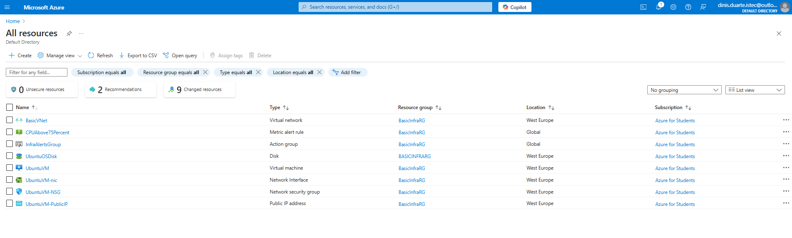
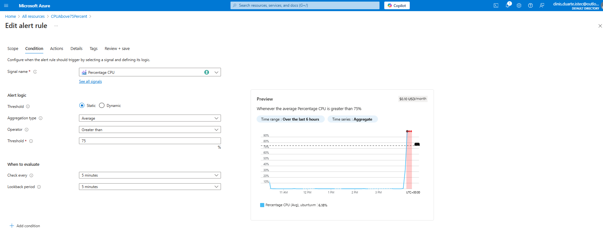
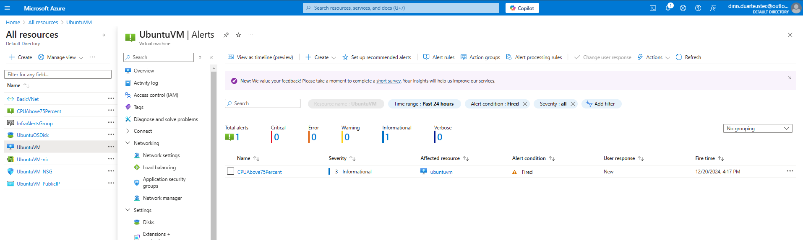
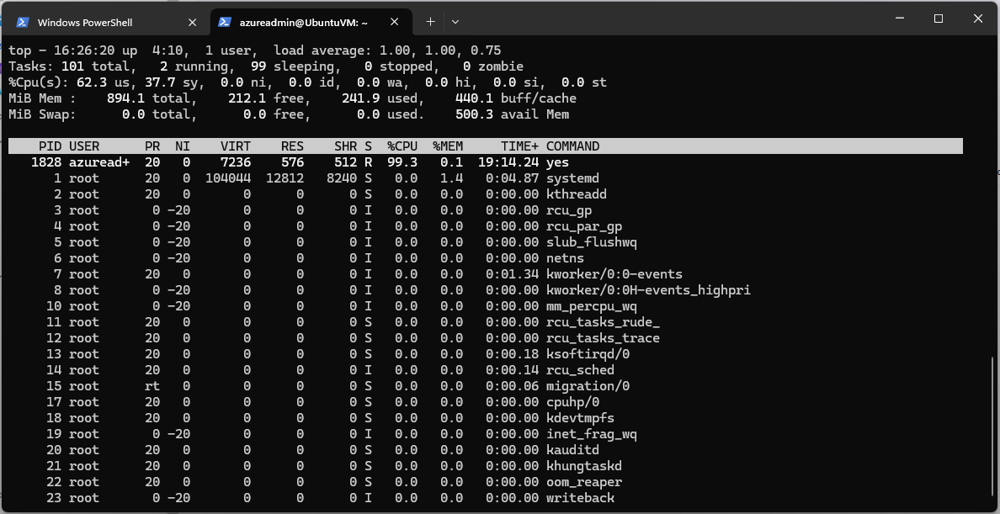
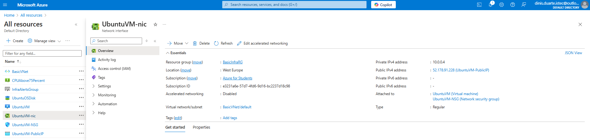
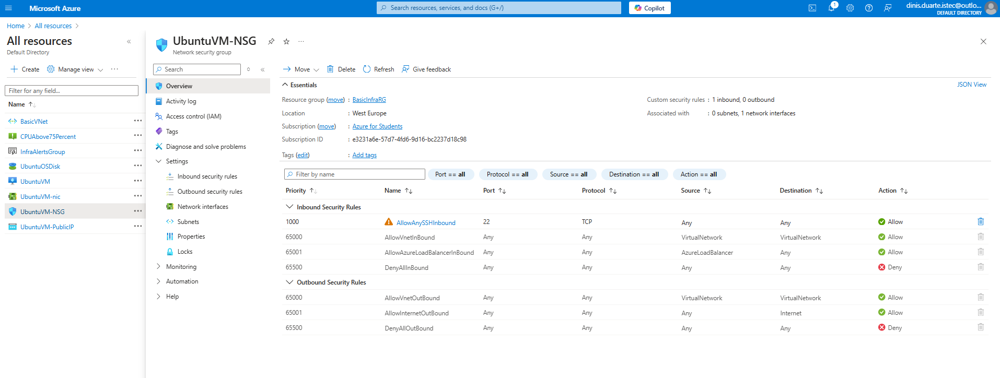
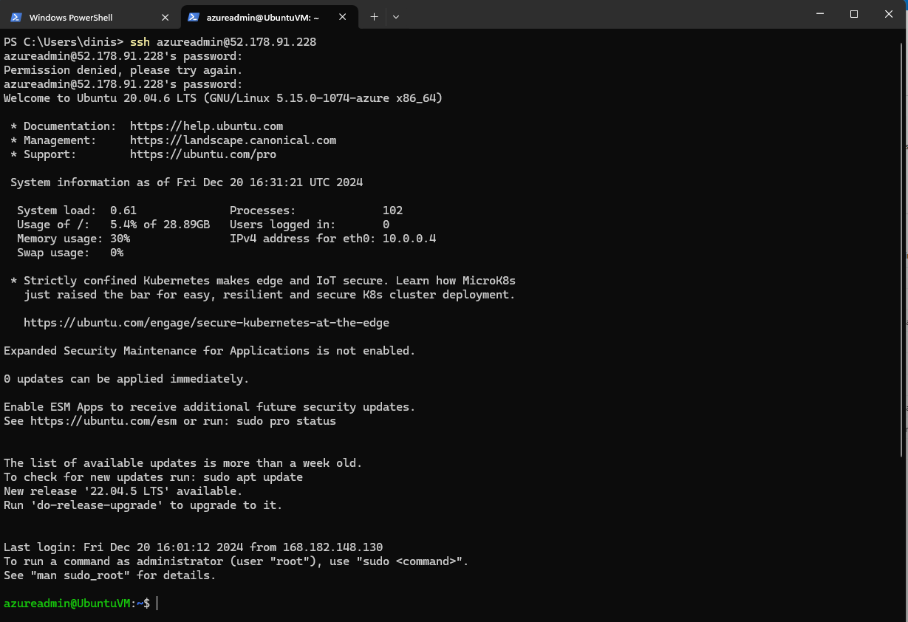
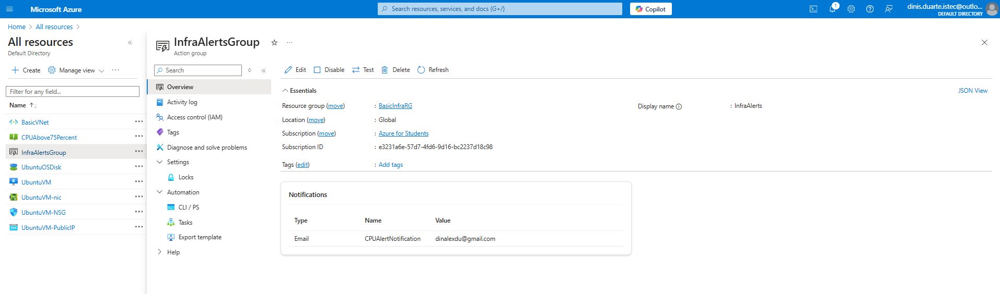

# Azure Monitoring Project
---
**A Hands-on Lab for Monitoring Azure Virtual Machines with Azure Monitor**
---

This project demonstrates how to set up and monitor an Azure Virtual Machine using Azure Monitor, including configuring alerts and notifications for CPU usage. It highlights essential monitoring practices and network configuration in Azure.

---

## Table of Contents
1. [Project Objectives](#project-objectives)
2. [Steps Implemented](#steps-implemented)
3. [Terraform Configuration](#terraform-configuration)
4. [Monitoring Setup](#monitoring-setup)
5. [Screenshots](#screenshots)
6. [Technologies Used](#technologies-used)
7. [Useful Links](#useful-links)
8. [License](#license)
9. [Contributions](#contributions)


---

## Project Objectives

- **Set Up Azure Resources:**  
  Create a virtual machine (VM), virtual network (VNet), and associated resources for hosting and monitoring.  

- **Implement Monitoring:**  
  Configure Azure Monitor to track CPU usage and set up alert rules for abnormal usage patterns.  

- **Test Alerts:**  
  Simulate high CPU usage to trigger alerts and validate email notifications through the configured action group.  

- **Automate with Terraform:**  
  Use Infrastructure as Code (IaC) to automate the deployment of the entire infrastructure.  

---

## Steps Implemented

1. **Clone the Repository**  
   - Downloaded the repository to the local environment:
     ```bash
     git clone https://github.com/dinAlexDu/azure-monitoring-project.git
     cd azure-monitoring-project
     ```

2. **Deploy Infrastructure with Terraform**  
   - Used Terraform to deploy the resources:
     ```bash
     terraform init
     terraform apply
     ```

3. **Access the VM via SSH**  
   - Connected to the virtual machine using SSH:
     ```bash
     ssh azureadmin@<public-ip>
     ```

4. **Simulate High CPU Usage**  
   - Run the following command to increase CPU usage and trigger the alert:
     ```bash
     yes > /dev/null &
     ```
   - To verify the running process, use:
     ```bash
     ps aux | grep yes
     ```
   - Identify the **PID** of the process created by the `yes > /dev/null &` command and terminate it using:
     ```bash
     kill <PID>
     ```
     Replace `<PID>` with the actual Process ID from the output of the `ps aux` command.


5. **Verify Alerts in Azure Monitor**  
   - Checked Azure Monitor for triggered alerts and validated email notifications.

6. **Clean Up Resources**  
   - Destroyed the infrastructure to avoid incurring charges:
     ```bash
     terraform destroy
     ```

---
## Terraform Configuration

## Terraform Configuration

The `main.tf` file automates the provisioning of Azure infrastructure. This configuration is used to deploy a resource group, virtual network, subnets, a public IP, and a virtual machine. Below is a breakdown of its components:

**➡️ [View the Full main.tf Configuration in the Repository](./main.tf)**
---

### 1. Provider Configuration

The provider block specifies the Azure Resource Manager (AzureRM) as the cloud provider and includes the subscription ID for deploying resources:

```hcl
provider "azurerm" {
  features {}
  subscription_id = "e3231a6e-57d7-4fd6-9d16-bc2237d18c98"
}
```
### 2. Resource Group
A resource group is created to organize all the Azure resources:

```hcl
resource "azurerm_resource_group" "rg" {
  name     = "BasicInfraRG"
  location = "West Europe"
}
```
  - Name: BasicInfraRG
  - Location: West Europe
    
### 3. Virtual Network (VNet)
Defines the virtual network with an address space of 10.0.0.0/16:

```hcl
resource "azurerm_virtual_network" "vnet" {
  name                = "BasicVNet"
  location            = azurerm_resource_group.rg.location
  resource_group_name = azurerm_resource_group.rg.name
  address_space       = ["10.0.0.0/16"]
}
```
### 4. Subnets
Two subnets are created within the virtual network for segmentation:

```hcl
resource "azurerm_subnet" "default" {
  name                 = "default"
  resource_group_name  = azurerm_resource_group.rg.name
  virtual_network_name = azurerm_virtual_network.vnet.name
  address_prefixes     = ["10.0.0.0/24"]
}

resource "azurerm_subnet" "basic" {
  name                 = "BasicSubnet"
  resource_group_name  = azurerm_resource_group.rg.name
  virtual_network_name = azurerm_virtual_network.vnet.name
  address_prefixes     = ["10.0.1.0/24"]
}
```
  - Subnets:
  - default: 10.0.0.0/24
  - BasicSubnet: 10.0.1.0/24

---
### 5. Public IP Address
Configures a static public IP address with a Standard SKU for the virtual machine:

```hcl
resource "azurerm_public_ip" "public_ip" {
  name                = "UbuntuVM-PublicIP"
  location            = azurerm_resource_group.rg.location
  resource_group_name = azurerm_resource_group.rg.name
  allocation_method   = "Static"
  sku                 = "Standard"
}
```
### 6. Network Interface
Creates a network interface to connect the VM to the virtual network:

```hcl
resource "azurerm_network_interface" "nic" {
  name                = "UbuntuVM-nic"
  location            = azurerm_resource_group.rg.location
  resource_group_name = azurerm_resource_group.rg.name

  ip_configuration {
    name                          = "internal"
    subnet_id                     = azurerm_subnet.default.id
    private_ip_address_allocation = "Dynamic"
    public_ip_address_id          = azurerm_public_ip.public_ip.id
  }
}
```
  - Private IP Allocation: Dynamic
  - Public IP Address: Linked to the previously created public_ip

### 7. Virtual Machine
Provisions a Linux-based virtual machine with an Ubuntu image:

```hcl
resource "azurerm_virtual_machine" "vm" {
  name                  = "UbuntuVM"
  location              = azurerm_resource_group.rg.location
  resource_group_name   = azurerm_resource_group.rg.name
  network_interface_ids = [azurerm_network_interface.nic.id]
  vm_size               = "Standard_B1s"
```
  - VM Name: UbuntuVM
  - Size: Standard_B1s (1 vCPU, 1GB RAM)

OS Disk
Defines the operating system disk with Standard_LRS storage type:

```hcl
  storage_os_disk {
    name              = "UbuntuOSDisk"
    caching           = "ReadWrite"
    create_option     = "FromImage"
    managed_disk_type = "Standard_LRS"
  }
```
OS Image
Specifies the Ubuntu 20.04 LTS image from Canonical:

```hcl
  storage_image_reference {
    publisher = "Canonical"
    offer     = "0001-com-ubuntu-server-focal"
    sku       = "20_04-lts-gen2"
    version   = "latest"
  }
```
OS Profile and Configuration
Configures the VM's admin username and password:

```hcl
  os_profile {
    computer_name  = "UbuntuVM"
    admin_username = "azureadmin"
    admin_password = "P@ssw0rd12345"
  }

  os_profile_linux_config {
    disable_password_authentication = false
  }
}
```

Highlights:
- Static Public IP for predictable network access.
- Segmented subnets for better network management.
- Standard B1s VM size for cost-effective deployment.
- Password authentication enabled for simplicity during testing.


For the full configuration, refer to the main.tf file in the repository.


## Monitoring Setup

### 1. Azure Monitor  
Azure Monitor is configured to track CPU usage and trigger alerts when specific thresholds are exceeded.

#### Steps to Configure CPU Usage Alerts:
1. Navigate to **Azure Monitor** in the Azure Portal.
2. Select **Alerts** > **+ Create** > **Alert rule**.
3. **Scope**: Select the target resource (e.g., the virtual machine `UbuntuVM`).
4. **Condition**: Choose the metric signal `Percentage CPU` and set the following:
   - **Threshold**: Static
   - **Operator**: Greater than
   - **Threshold Value**: `75`
   - **Aggregation Type**: Average
   - **Evaluation Period**: 5 minutes  
   - **Frequency of Evaluation**: Every 5 minutes
5. **Action Group**: Select an existing Action Group or create a new one (see below).
6. **Details**: Provide a name for the alert rule (e.g., `CPUAbove75Percent`) and select its severity.
7. Save the configuration.

### 2. Action Group  
Action Groups define how Azure Monitor alerts notify users or take automated actions.

#### Steps to Create an Action Group:
1. In the Azure Portal, go to **Monitor** > **Manage Action Groups** > **+ Add Action Group**.
2. **Details**:
   - **Action Group Name**: `InfraAlertsGroup`
   - **Short Name**: `InfraAlerts`
   - **Subscription**: Select your Azure subscription.
   - **Resource Group**: `BasicInfraRG`
3. **Notifications**:
   - Select **Notification Type**: Email/SMS/Push/Voice.
   - Provide the required details (e.g., email address: `youremail@example.com`).
4. **Actions**:
   - (Optional) Configure automated actions such as webhooks or Azure Functions.
5. **Review and Create**: Save the Action Group.

#### How to Configure Multiple Email Recipients:
- To add multiple email recipients, separate the email addresses with commas in the **Email/SMS/Push/Voice** section of the Action Group configuration.

#### Verify Action Group:
- Navigate to **Action Groups** in the Azure Portal.
- Locate the `InfraAlertsGroup` and check its notification and action settings.

#### Notes:
- Action Groups can also be configured to integrate with **ITSM tools**, **Logic Apps**, or **Automation Runbooks** for advanced scenarios.
- Ensure that email notifications are verified to avoid missing critical alerts.

---

---

## Screenshots

### 1. Azure Resources Overview  
  
*Lists all resources created in the `BasicInfraRG` resource group.*

### 2. Alert Configuration  
  
*Shows the configuration of the alert rule monitoring CPU usage above 75%.*

### 3. Alert Fired  
  
*Indicates an alert was triggered due to high CPU usage.*

### 4. CPU Utilization Test  
  
*Displays the `yes > /dev/null &` command used to simulate high CPU usage.*

### 5. VM Networking  
  
*Shows the network configuration of the virtual machine, including public and private IPs.*

### 6. Inbound Security Rule  
  
*NSG inbound rule allowing SSH access (port 22).*

### 7. SSH Connection  
  
*Shows a successful SSH session with the VM.*

### 8. Action Group Configuration  
  
*Displays the configuration of the action group, including email notifications.*

---

## Technologies Used

- **[Terraform](https://developer.hashicorp.com/terraform):** Infrastructure as Code (IaC) for provisioning resources.  
- **[Azure Monitor](https://learn.microsoft.com/en-us/azure/azure-monitor/):** Monitoring and alerting for Azure resources.  
- **[Azure Virtual Machines](https://learn.microsoft.com/en-us/azure/virtual-machines/):** Platform for deploying and managing virtual machines.  
- **[Azure CLI](https://learn.microsoft.com/en-us/cli/azure/):** Command-line interface for managing Azure resources.  

---

## Useful Links

- **[Azure Monitor Documentation](https://learn.microsoft.com/en-us/azure/azure-monitor/):**  
  Guide to setting up monitoring and alerting in Azure.  

- **[Terraform Documentation](https://developer.hashicorp.com/terraform):**  
  Official Terraform documentation for managing cloud infrastructure.  

- **[Azure VM Documentation](https://learn.microsoft.com/en-us/azure/virtual-machines/):**  
  Comprehensive guide to Azure Virtual Machines.  

- **[Azure CLI Documentation](https://learn.microsoft.com/en-us/cli/azure/):**  
  Official guide for using the Azure CLI.  

---

## License

This project is licensed under the [MIT License](./LICENSE).  
See the LICENSE file for detailed terms and conditions.  

---

## Contributions

Contributions are welcome!  
If you have suggestions for improvements or additional use cases, feel free to [fork this repository](https://github.com/dinAlexDu/azure-monitoring-project) and submit a pull request.  

Please adhere to our [Code of Conduct](./CODE_OF_CONDUCT.md) when contributing to this project.  
